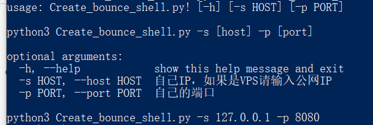
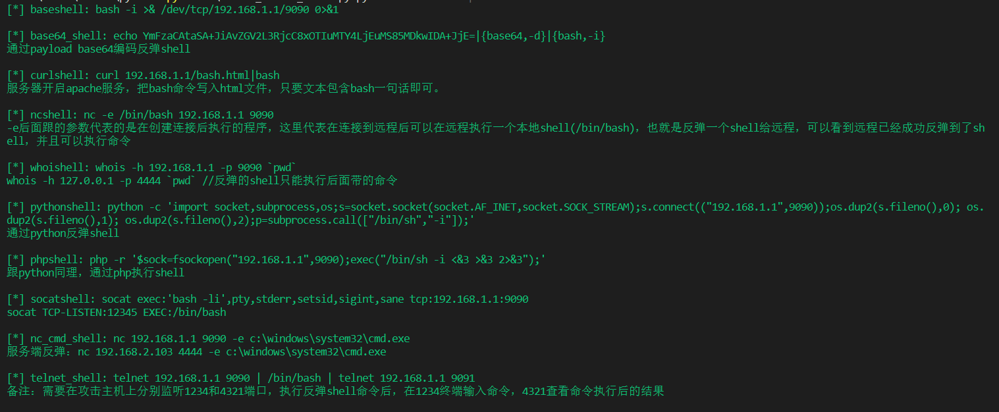
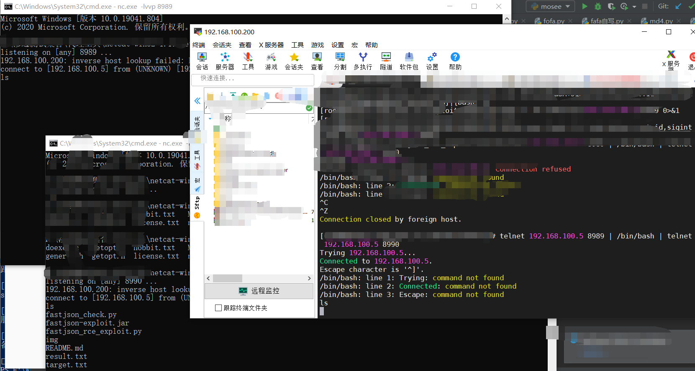

# Create_bounce_shell
# Create_bounce_shell

## 工具简介

Create_bounce_shell.py

工具用于批量生成反弹shell命令，包含了多种反弹shell的语法

## 使用方法

python Create_bounce_shell.py.py -s 192.168.1.1 -p 9090

## 案例

telnet反弹shell

